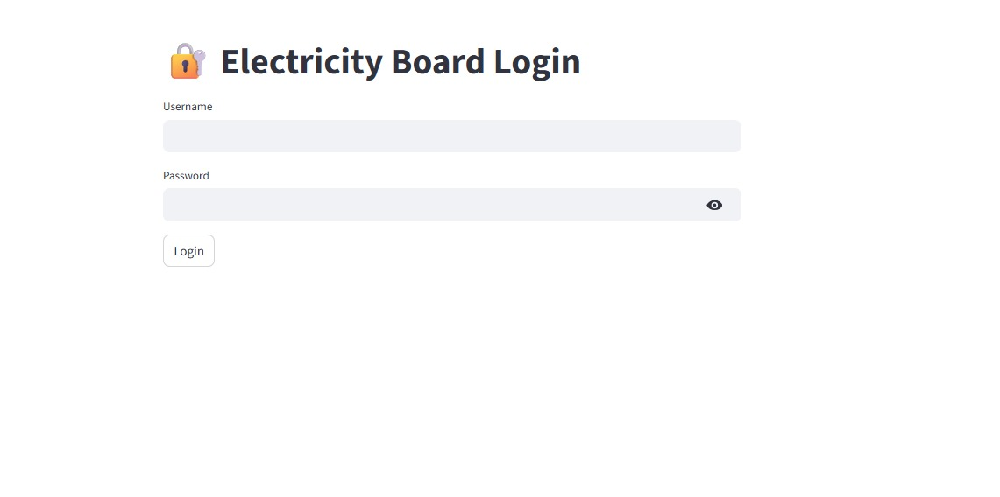
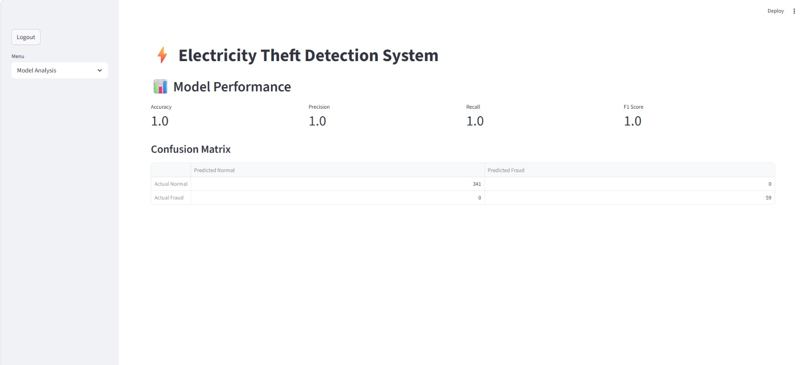
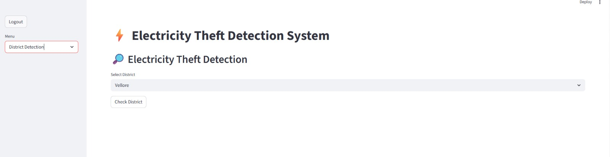
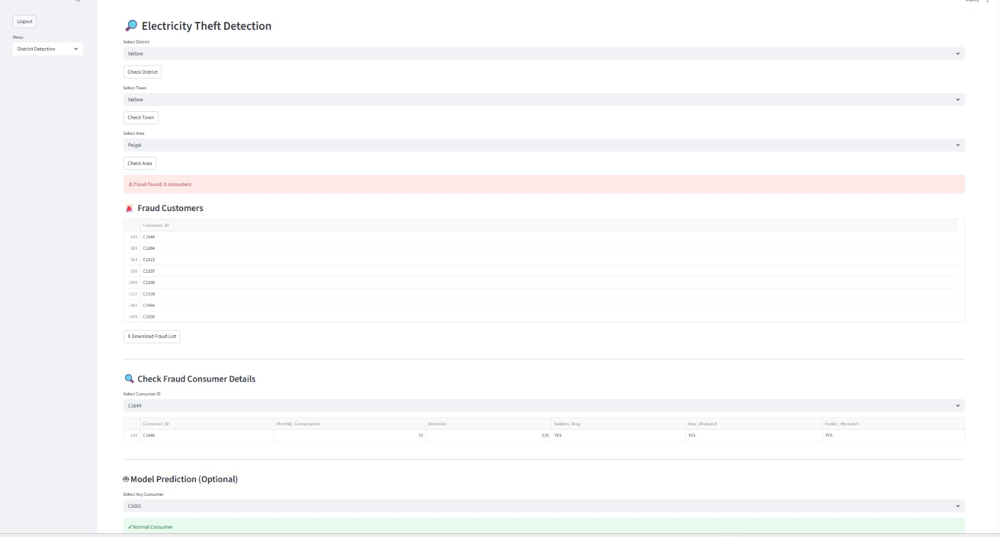
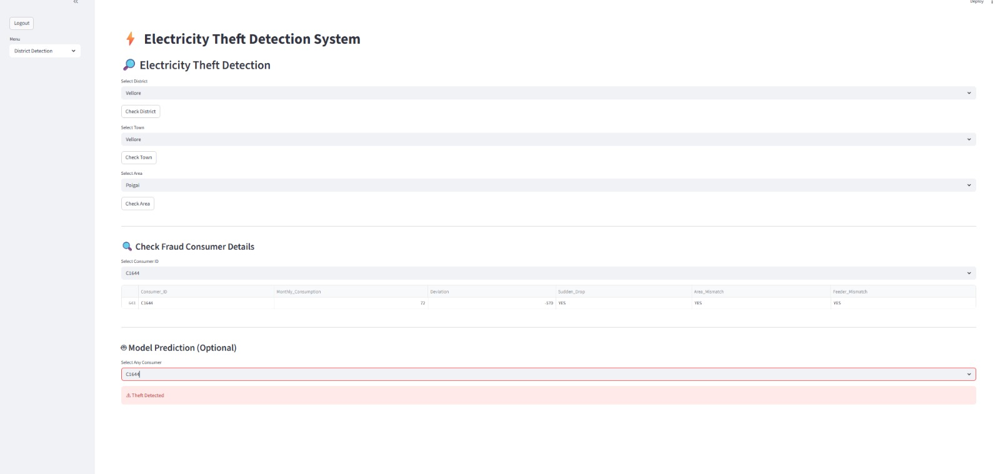

# ⚡ Electricity Theft Detection System

A Machine Learning-based web application that detects electricity theft using electricity consumption patterns. This system helps electricity board officers identify suspicious consumers through district-wise, town-wise, and area-wise analysis using a Random Forest Classifier and an interactive Streamlit dashboard.

---

## 📌 Overview

The Electricity Theft Detection System analyzes consumer electricity usage and predicts whether a consumer is normal or involved in electricity theft (Non-Technical Loss). The system provides an easy-to-use dashboard for electricity board officers to monitor and detect fraud consumers efficiently.

---

## ✨ Features

- 🔐 Secure Login Authentication
- 📊 Model Performance Analysis
- 🏙 District-wise Detection
- 🌍 Town-wise Detection
- 📍 Area-wise Detection
- 🚨 Fraud Consumer Identification
- 👤 Consumer Detail Analysis
- 🤖 Machine Learning Prediction
- 📥 Download Fraud Consumer Report

---

## 🛠 Technologies Used

- Python
- Streamlit
- Pandas
- Scikit-learn
- Random Forest Classifier
- Joblib

---

## 📂 Project Structure

```
Electricity-Theft-Detection/
│
├── app.py
├── train_model.py
├── README.md
│
├── dataset/
│   └── electricity_data.csv
│
├── screenshots/
│   ├── login_page.png
│   ├── model_performance.png
│   ├── district_detection.png
│   ├── fraud_customers.png
│   └── theft_detection.png
│
└── model/
    ├── model.pkl
    ├── scaler.pkl
    └── metrics.pkl
```

---

## 🤖 Machine Learning Model

- **Algorithm:** Random Forest Classifier

### Input Features

| Feature | Description |
|---|---|
| Monthly_Consumption | Current month units consumed |
| Avg_6_Months | Average of last 6 months |
| Area_Avg | Area average consumption |
| Feeder_Avg | Feeder average consumption |
| Deviation | Difference from average |
| Sudden_Drop | Sudden drop in consumption |
| Area_Mismatch | Mismatch with area average |
| Feeder_Mismatch | Mismatch with feeder average |

### Target
- `0` → Normal Consumer
- `1` → Electricity Theft

---

## 📷 Screenshots

### 🔐 Login Page


### 📊 Model Performance


### 🔎 District Detection


### 🚨 Fraud Detection


### ⚡ Theft Detection


---

## ▶️ Installation

### 1. Clone the repository
```bash
git clone https://github.com/YourUsername/Electricity-Theft-Detection.git
```

### 2. Go to the project folder
```bash
cd Electricity-Theft-Detection
```

### 3. Install dependencies
```bash
pip install pandas scikit-learn joblib streamlit
```

### 4. Train the model
```bash
python train_model.py
```

### 5. Run the application
```bash
python -m streamlit run app.py
```

---

## 🔑 Login Credentials

| Role | Username | Password |
|---|---|---|
| Admin | admin | 1234 |
| Officer | officer | 1234 |

---

## 📊 Model Performance

| Metric | Score |
|---|---|
| Accuracy | 1.00 |
| Precision | 1.00 |
| Recall | 1.00 |
| F1 Score | 1.00 |

---

## 🔄 Workflow

```
Consumer Data
      │
      ▼
Data Preprocessing
      │
      ▼
Feature Engineering
      │
      ▼
Random Forest Classifier
      │
      ▼
Fraud Prediction
      │
      ▼
Streamlit Dashboard
      │
      ├── Login
      ├── Model Analysis
      ├── District Detection
      ├── Town Detection
      ├── Area Detection
      ├── Fraud Consumer List
      └── Consumer Prediction
```

---

## 🚀 Future Improvements

- Smart Meter Integration
- Real-time Monitoring
- GIS Map Visualization
- Email Notifications
- SMS Alerts
- Cloud Deployment
- Mobile Application

---

## 👩‍💻 Author

**M. Monisha**
B.Tech Artificial Intelligence and Data Science

---

## ⭐ Support

If you found this project helpful, please give it a ⭐ on GitHub!

---

## 📄 License

This project is developed for educational and academic purposes only.
